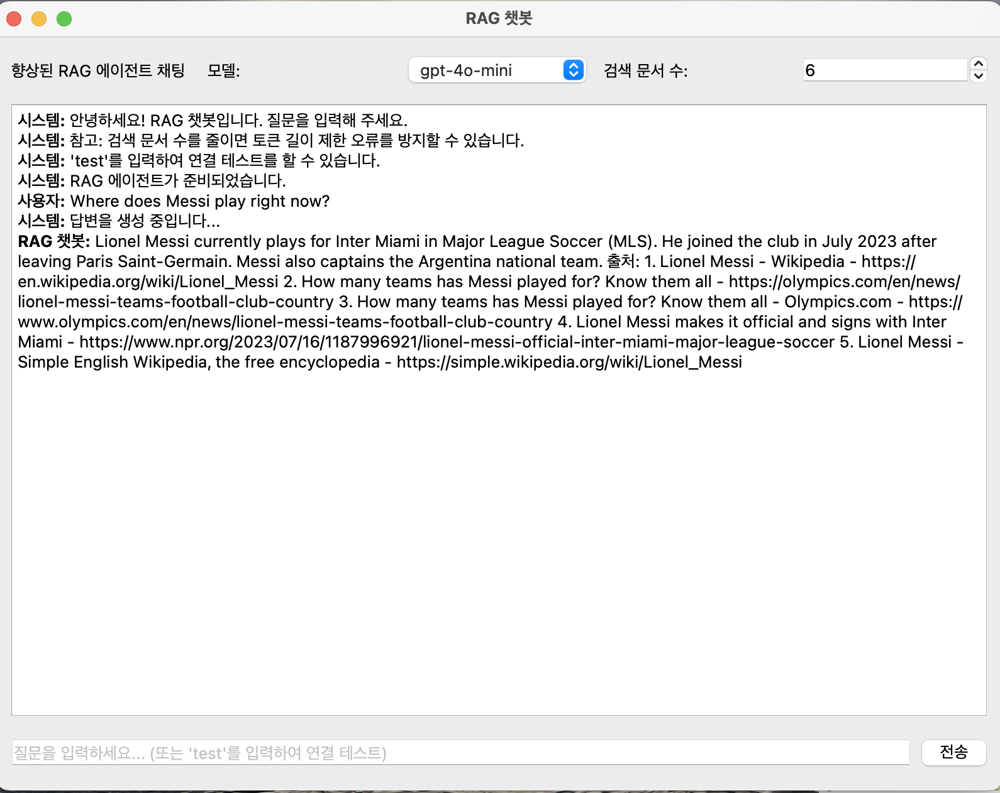

# 고급 RAG 시스템

고급 검색 증강 생성(RAG) 시스템을 구현한, LangChain과 OpenAI API를 활용한 프로젝트입니다.

## 주요 기능

- **벡터 검색 기반 RAG**: 문서를 임베딩하여 벡터 스토어에 저장하고, 사용자 질문과 유사한 문서를 검색하여 답변 생성
- **할루시네이션 감지**: 생성된 답변에 할루시네이션이 있는지 검사하고, 발견 시 재시도
- **관련성 평가**: 검색된 문서가 실제로 질문과 관련이 있는지 평가하고 필터링
- **RAPTOR 인덱스**: 계층적 구조를 활용한 개선된 검색 방식 구현
- **LangGraph 기반 에이전트**: 그래프 구조로 워크플로우를 구성하여 복잡한 RAG 시스템 구현
- **벤치마킹 도구**: 시스템 성능 평가를 위한 도구 제공
- **PyQt6 기반 그래픽 사용자 인터페이스**: 사용자 친화적인 채팅 UI 제공

## 사용자 인터페이스

PyQt6 기반으로 개발된 직관적인 채팅 인터페이스를 통해 RAG 시스템과 쉽게 상호작용할 수 있습니다:



주요 UI 기능:
- 모델 선택 (gpt-4o-mini, gpt-3.5-turbo)
- 검색 문서 수 조정 (1-10개)
- 실시간 대화 기록 표시
- 시스템 상태 메시지 확인

## 프로젝트 구조

```
src/
├── config/                 # 설정 관련 모듈
│   ├── __init__.py
│   ├── openai_config.py    # OpenAI API 설정
│   └── tavily_config.py    # Tavily API 설정
├── data_loader/            # 데이터 로딩 관련 모듈
│   ├── __init__.py
│   └── web_loader.py       # 웹 URL에서 데이터 로드
├── text_processing/        # 텍스트 처리 관련 모듈
│   ├── __init__.py
│   └── splitter.py         # 문서 분할 및 그룹화
├── embeddings/             # 임베딩 관련 모듈
│   ├── __init__.py
│   └── vector_store.py     # 벡터 스토어 생성 및 관리
├── retrieval/              # 검색 관련 모듈
│   ├── __init__.py
│   └── retriever.py        # 문서 검색 및 포맷팅
├── evaluation/             # 평가 관련 모듈
│   ├── __init__.py
│   ├── relevance.py        # 관련성 평가
│   └── hallucination.py    # 할루시네이션 평가
├── rag/                    # RAG 관련 모듈
│   ├── __init__.py
│   ├── answer_chain.py     # 답변 생성 체인
│   ├── rag_chain.py        # RAG 체인 구현
│   └── enhanced_graph_agent.py # LangGraph 기반 RAG 에이전트
├── raptor/                 # RAPTOR 관련 모듈
│   ├── __init__.py
│   ├── raptor_index.py     # RAPTOR 인덱스 구현
│   └── rag_chain.py        # RAPTOR RAG 체인
├── ingestion/              # 데이터 수집 관련 모듈
│   ├── __init__.py
│   └── ingestion.py        # 데이터 수집 및 처리
├── ui/                     # UI 관련 모듈
│   ├── __init__.py
│   └── rag_chat_ui.py      # PyQt6 기반 채팅 UI
├── utils/                  # 유틸리티 모듈
│   ├── __init__.py
│   └── benchmark.py        # 벤치마킹 도구
├── tests/                  # 테스트 모듈
│   ├── __init__.py
│   └── test_rag.py         # RAG 테스트
├── main.py                 # 메인 실행 모듈
├── main_enhanced_graph_rag_agent.py # 향상된 그래프 RAG 에이전트 실행 모듈
├── main_graph_rag_agent.py # 기본 그래프 RAG 에이전트 실행 모듈
├── main_rag_chat_ui.py     # 채팅 UI 실행 모듈
└── code_review.md          # 코드 리뷰 및 리팩토링 문서
```

## 설치 방법

1. 필요한 패키지 설치:

```bash
pip install -r requirements.txt
```

2. API 키 설정:
   - OpenAI API 키: `config/openai_key.txt` 파일에 저장
   - Tavily API 키: `config/tavily_key.txt` 파일에 저장 (웹 검색용)

## 사용 방법

### 채팅 UI 사용하기

```bash
# 그래픽 UI 실행
python -m src.main_rag_chat_ui
```

### 기본 RAG 시스템 사용

```python
from src.main import setup_vector_store, run_rag_query

# 데이터 로드 및 벡터 스토어 생성
urls = [
    "https://example.com/document1.html",
    "https://example.com/document2.html"
]
setup_vector_store(urls)

# 질문 실행
question = "이 문서들의 핵심 내용은 무엇인가요?"
result = run_rag_query(question)

# 결과 출력
print(f"답변: {result['answer']}")
print(f"할루시네이션 발견: {'예' if result.get('hallucination_detected', False) else '아니오'}")
print(f"출처: {result['formatted_sources']}")
```

### RAPTOR 인덱스 사용

```python
from src.main import setup_raptor_index, run_raptor_query

# RAPTOR 인덱스 생성
urls = [
    "https://example.com/document1.html",
    "https://example.com/document2.html"
]
setup_raptor_index(urls)

# 질문 실행
question = "이 문서들의 핵심 내용은 무엇인가요?"
result = run_raptor_query(question)

# 결과 출력
print(f"답변: {result['answer']}")
```

### LangGraph 기반 RAG 에이전트 사용

```python
from src.main_enhanced_graph_rag_agent import run_graph_rag_query

# 질문 실행
question = "프롬프트 엔지니어링이란 무엇인가요?"
result = run_graph_rag_query(question)

# 결과 출력
print(f"질문: {result['question']}")
print(f"답변: {result['answer']}")
```

### 시스템 평가

```python
from src.main import evaluate_system

# 테스트 쿼리 설정
yes_queries = ["LangChain이란 무엇인가요?", "RAG는 어떻게 작동하나요?"]
no_queries = ["가장 맛있는 피자 레시피는?", "축구 월드컵 우승국은?"]

# 시스템 평가 실행
evaluation_result = evaluate_system(yes_queries, no_queries)

# 결과 확인
print(f"정확도: {evaluation_result['overall_success_rate']:.1f}%")
print(f"F1 점수: {evaluation_result['f1']:.3f}")
```

## 주요 모듈 설명

### 1. 데이터 로딩 (`data_loader`)

- 웹 URL에서 문서를 로드하는 기능 제공
- 디버그 모드 지원으로 로드 과정 모니터링 가능

### 2. 텍스트 처리 (`text_processing`)

- RecursiveCharacterTextSplitter를 사용하여 문서를 청크로 분할
- 청크 크기와 중복 정도 조절 가능
- 소스별 그룹화 기능 제공

### 3. 임베딩 및 벡터 스토어 (`embeddings`)

- OpenAI 임베딩 모델을 사용하여 문서 임베딩
- Chroma 벡터 스토어 생성 및 관리

### 4. 검색 (`retrieval`)

- 벡터 스토어에서 관련 문서 검색
- 문서 및 출처 포맷팅 기능 제공

### 5. 평가 (`evaluation`)

- 검색 결과와 쿼리 간의 관련성 평가
- 생성된 답변의 할루시네이션 검사
- 개선된 할루시네이션 분석 제공

### 6. RAG 체인 (`rag`)

- 관련성 평가 통합 RAG 체인
- 할루시네이션 검사 통합 RAG 체인
- 답변 생성 체인
- LangGraph 기반 향상된 RAG 에이전트

### 7. RAPTOR (`raptor`)

- 계층적 인덱스 구조를 활용한 개선된 검색
- 그룹 유사도를 고려한 검색 결과 제공
- RAPTOR RAG 체인 구현

### 8. 사용자 인터페이스 (`ui`)

- PyQt6 기반 채팅 인터페이스
- 문서 검색 수 조정 기능
- 모델 선택 기능 (gpt-4o-mini, gpt-3.5-turbo)
- 비동기 질의응답 처리

### 9. 유틸리티 (`utils`)

- 쿼리 목록에 대한 테스트 도구
- 종합적인 평가 메트릭 계산 (정확도, 정밀도, 재현율, F1 점수 등)

## LangGraph 기반 향상된 RAG 에이전트

LangGraph를 활용해 상태 기반 워크플로우를 그래프로 구성한 향상된 RAG 시스템입니다.

### 주요 특징

- **그래프 기반 상태 관리**: 복잡한 워크플로우를 노드와 엣지로 구성
- **관련성 평가 및 할루시네이션 탐지**: 검색 결과와 답변의 품질 보장
- **다중 검색 경로**: 로컬 벡터 스토어와 Tavily 웹 검색을 통합
- **적응형 검색 전략**: 관련 문서를 찾지 못하면 대체 검색 경로로 전환
- **출처 추적**: 생성된 답변에 대한 출처 정보 제공

### 워크플로우

```
[docs_retrieval] → [relevance_checker] → (관련성 있음) → [generate_answer] → [hallucination_checker] → (근거 있음) → [finalize_answer]
                                       → (관련성 없음) → [search_trivily] → [relevance_checker]
                                       → (실패) → [handle_relevance_failure]
                                                                         → (근거 없음) → [generate_answer]
                                                                         → (실패) → [handle_hallucination_failure]
```

자세한 정보는 [README_RAG_AGENT.md](README_RAG_AGENT.md)를 참조하세요.

## 코드 리팩토링 및 품질 개선

이 프로젝트는 LangChain과 RAG를 활용한 코드베이스의 모듈화 및 구조 개선을 통해 다음과 같은 발전을 이루었습니다:

1. **모듈화 구조 도입**: 기능별로 분리된 패키지와 모듈 생성
2. **중복 코드 제거**: 유사 기능 함수들 통합으로 중복 최소화
3. **체계적인 문서화**: 모든 함수와 클래스에 상세한 독스트링 추가
4. **일관된 코드 스타일**: 전체 코드베이스에 일관된 스타일 적용
5. **설정 분리**: API 키와 같은 설정을 별도 모듈로 분리
6. **타입 힌팅 도입**: 함수와 메서드에 타입 힌팅 추가
7. **디버깅 기능 강화**: 디버그 모드 추가로 개발 및 문제 해결 용이화

자세한 정보는 [src/code_review.md](src/code_review.md)를 참조하세요.

## 라이센스

MIT

## 기여

이슈와 풀 리퀘스트를 통한 기여를 환영합니다.
